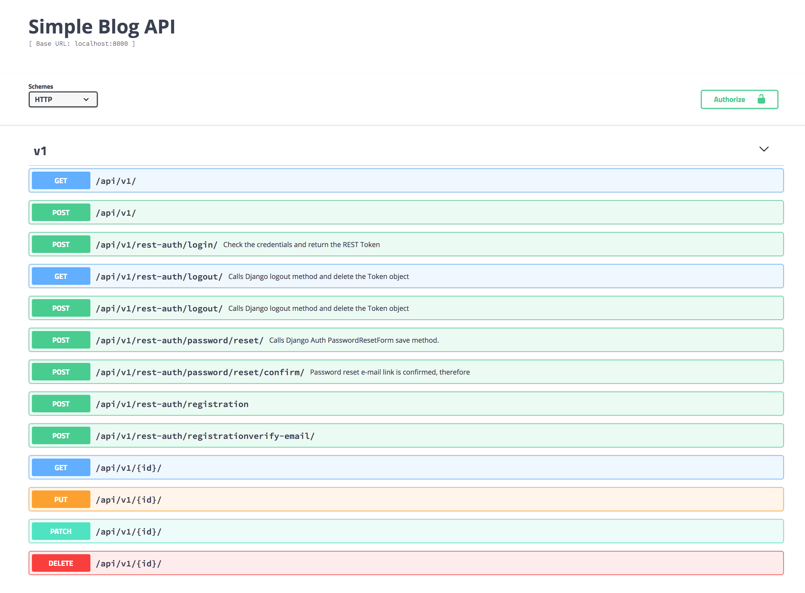

## Blog API Learning Curve

`Blog API` is DRF based API to smooth my learning curve and keep in a simple repo
all the code I always search with the question `why I made it like this?`.
Each commit is basically as small answer.

View the commit history to enjoy my darkness.

### Setup with pipenv, python3 support and of course after clone it

1. pipenv install
2. pipenv shell
3. python manage.py migrate
4. python manage.py createsuperuser
4. python manage.py runserver
5. visit http://localhost:8000/api/swagger

The final endpoint based on swagger view

